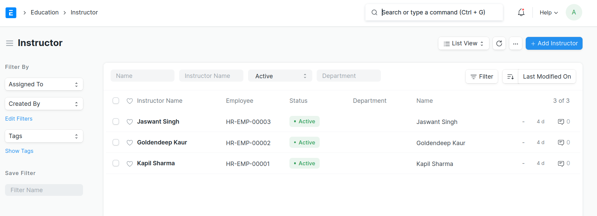

# Daily-Diary-Project
In this I create a daily diary system in the frappe framework in which techers of school add their daily diary or daily progress according to different classes. The students also see their daily homework and daily classwork.

## Prerequisite for this Work
Framework Used:- Frappe Framework

The User who is creting this system have access to create the web-page, users,instructors,doctype,program and courses.

## ***Steps to Create the daily diary system***

First we need some users which can perform their respective tasks. 

### List of different users we required

- Teachers
- Students

### - After creating the users convert the users of teachers to instructers by creating the new instructors. 

<p align="center">
  
</p>

### - After creating the instructers, create the subjects(courses) which are students study in their class.

<p align="center">
  
</p>

### - After creating the subjects, crete the different classes in which students study.

<p align="center">
  
</p>

### - After creating the users,instructers,programs and courses. Create a doctype in which all the teachers add their daily diaries.

### - The fields required in the doctype are described below:

- Date 
- Class 
- Course 
- Title of today work 
- Homework

<p align="center">
  
</p>

### In this doctype all the techers add their daily diary work.

<p align="center">
  
</p>

### For the student view as the student doesn't have desk access so create a web form for the students.

- Add the following html code for the student view you can also see the view in the following images.

```
<html>
<br>

<h1 id="heading" style="text-align:center" >Today Diary</h1>
<head>

<div class="toolbar d-flex">
<div class="input-group col-4 p-2">
<div class="dropdown w-100" id="search-box">
<input type="text" name="query" id="myInput" class="form-control
font-md" onkeyup="myFunction()" placeholder="Search"
aria-label="Mentor-Mentee" aria-describedby="button-addon2">
<div class="search-icon">
<svg xmlns="http://www.w3.org/2000/svg" width="16" height="16"
viewBox="0 0 24 24" fill="none" stroke="black" stroke-width="4"
stroke-linecap="round" stroke-linejoin="round" class="feather
feather-search">
<circle cx="11" cy="11" r="8"></circle>
<line x1="21" y1="21" x2="16.65" y2="16.65"></line>
</svg>
</div>
</div>
</div>

</div>
</head>
<br>
<body>
    <table class="table"  id="myTa">
        <thead class="thead-dark">
            <tr style="text-align:center">
                <th scope="col">Date</th>
                <th scope="col">Subject</th>
                <th scope="col">Classwork</th>
                <th scope="col">Homework</th>
            </tr>
        </thead>
        <tbody id="myTable">
            
            <tr>
                <td>
                    {{daily_diary[0] }}
                </td>
                <td>
                    {{daily_diary[1] }}
                </td>
                <td>
                    {{daily_diary[2] }}
                </td>
                <td>
                    {{daily_diary[3] }}
                </td>
            </tr>
            
        </tbody>
    </table>
</body>

</html>

```

##### - As we are fetching the data from the backend which is stored in the "tabDaily Diary"(Doctype created). We need that the login student only see their class daily diary. So for this I write a query which is written in the context script in the web-page.

```
user = frappe.session.user
context.maintenances = frappe.db.sql(f" select d.date,d.course, d.description,d.homework from `tabDaily Diary` as d join `tabProgram Enrollment` as p on p.program = d.class join tabUser as u on p.student_name = u.first_name where u.email = %s ", user);

```

- After this the student only see their own class daily diary.


